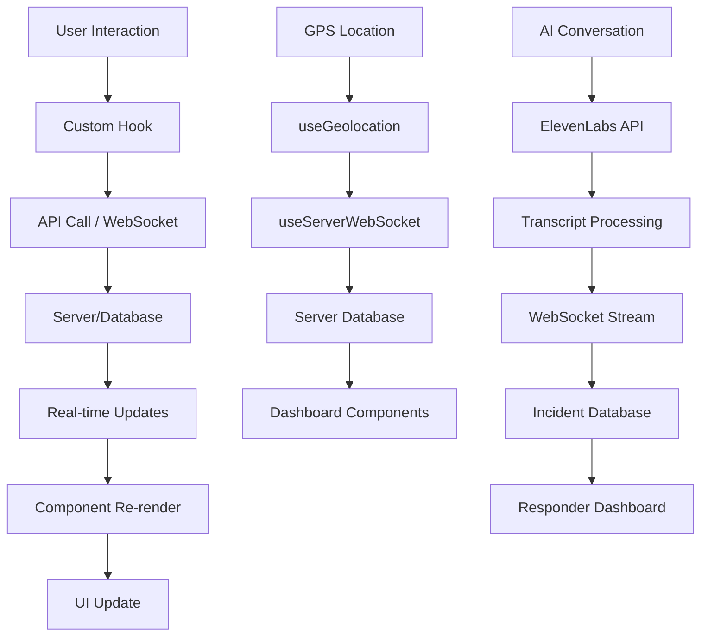
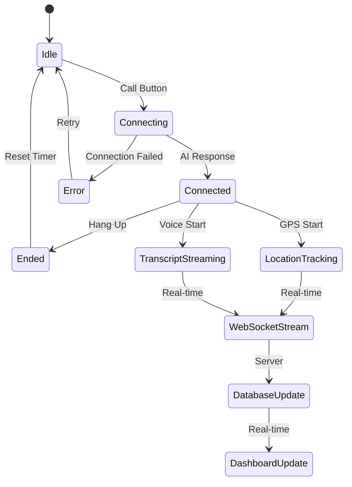

# UI Architecture Analysis - Disaster Response System

## Overview

The Disaster Response System is a real-time emergency coordination platform built with **Next.js 16.1.6** and **React 19.2.3**. The system serves three primary user types: People in Danger (via AI voice interface), First Responders (dashboard), and Hospital Workers (dashboard), all connected through a unified real-time data flow.

## Architecture Principles

### 1. **Single Source of Truth**
- All data flows through a centralized database (Supabase implied)
- Real-time synchronization via WebSocket connections
- API layer abstracts backend complexity (`@/lib/api`)

### 2. **Component-Driven Design**
- Built on **shadcn/ui** component library using Radix UI primitives
- Consistent design system with Tailwind CSS
- Extensive use of compound components for complex UI patterns

### 3. **Real-Time First**
- WebSocket integration for live data streaming (`use-server-websocket`)
- GPS tracking with real-time position updates (`use-geolocation`)
- AI conversation streaming via ElevenLabs (`use-elevenlabs-conversation`)

## Tech Stack Analysis

### Core Framework
- **Next.js 16.1.6** (App Router)
- **React 19.2.3** (Latest features)
- **TypeScript** (Full type safety)

### UI Libraries
- **shadcn/ui** (Component system)
- **Radix UI** (Accessible primitives)
- **Tailwind CSS** (Styling system)
- **Tabler Icons** (Icon library)

### Mapping & Visualization
- **Mapbox GL JS** (Interactive maps)
- **Three.js** (3D models for vehicles)
- **Recharts** (Data visualization)

### Real-Time Infrastructure
- **WebSocket API** (Live data streaming)
- **ElevenLabs** (AI voice conversations)
- **Geolocation API** (GPS tracking)

## Data Models

### Core Entity Types (from `/types/api.ts`)

```typescript
// Primary incident tracking
interface Incident {
  id: string
  type: "fire" | "medical" | "rescue" | "flood" | "accident" | "other"
  location: string
  coordinates: { lat: number; lon: number }
  severity: 1 | 2 | 3 | 4 | 5
  status: "new" | "dispatched" | "in_progress" | "resolved"
  reportedAt: string
  assignedUnits: string[]
  description: string
}

// Emergency response units
interface ResponderUnit {
  id: number
  unitName: string
  unitType: "Ambulance" | "Fire Truck" | "Police" | "Rescue" | "Hazmat" | "Medical"
  status: "Available" | "Responding" | "On Scene" | "Returning" | "Offline"
  location: string
  coordinates?: { lat: number; lon: number }
  eta: string
  assignedIncident: string
}

// Hospital system integration
interface Hospital {
  id: string
  name: string
  distance: number
  status: "accepting" | "limited" | "diverting" | "closed"
  erAvailable: number
  icuAvailable: number
  specialties: string[]
}
```

### Real-Time Payload Types

```typescript
// WebSocket location streaming
interface LocationPayload {
  user_id: string
  data: {
    lat: number
    lon: number
    timestamp: number
    accuracy?: number
  }
}

// AI conversation transcripts
interface TranscriptPayload {
  user_id: string
  data: {
    transcript: {
      text: string
      is_final: boolean
    }
  }
}
```

## State Management Patterns

### 1. **React Hooks Strategy**
The system uses a **hooks-based state management** approach rather than Redux or Zustand:

- **Local Component State**: `useState` for UI-specific state
- **Custom Hooks**: Complex state logic abstracted into reusable hooks
- **Server State**: API calls with local caching, no global state management

### 2. **Key Custom Hooks**

#### `useServerWebSocket` (`hooks/use-server-websocket.ts`)
```typescript
// Manages dual WebSocket connections for location and transcript streaming
const {
  status,           // Connection state
  sendLocation,     // Stream GPS coordinates
  sendTranscript,   // Stream conversation text
  connect,          // Establish connections
  disconnect,       // Close connections
  isConnected       // Boolean status
} = useServerWebSocket({
  userId: sessionId,
  onStatusChange: (status) => {},
  onError: (error) => {},
  onMessage: (data) => {}
})
```

#### `useGeolocation` (`hooks/use-geolocation.ts`)
```typescript
// High-accuracy GPS tracking with throttling and history
const {
  position,         // Current GPS position
  error,            // Geolocation errors
  permissionState,  // Browser permission status
  isWatching,       // Active tracking status
  isLoading,        // Initial GPS acquisition
  startWatching,    // Begin tracking
  stopWatching,     // End tracking
  locationHistory   // Position history array
} = useGeolocation({
  enableHighAccuracy: true,
  throttleMs: 3000,
  maxHistoryLength: 100,
  onPositionUpdate: (pos) => {},
  onError: (err) => {}
})
```

#### `useElevenLabsConversation` (`hooks/use-elevenlabs-conversation.ts`)
```typescript
// AI voice conversation management
const {
  startConversation,  // Initiate AI call
  endConversation,    // End AI call
  setMicMuted,        // Toggle microphone
  status,             // Connection status
  mode,               // "speaking" | "listening"
  messages,           // Conversation history
  error               // Connection errors
} = useElevenLabsConversation({
  onConnect: () => {},
  onDisconnect: () => {},
  onError: (message) => {}
})
```

### 3. **State Flow Architecture**



## Component Hierarchy

### Page-Level Architecture

```
app/
├── layout.tsx              # Root layout with fonts
├── page.tsx               # Home (ComponentExample)
├── dashboard/
│   ├── page.tsx           # Main responder dashboard
│   ├── hospitals/page.tsx # Hospital-specific view
│   └── civilians/page.tsx # People in danger view
└── emergency/
    ├── layout.tsx         # Emergency call layout
    └── page.tsx          # Emergency call interface
```

### Component Organization

```
components/
├── ui/                    # shadcn/ui base components (50+ components)
│   ├── card.tsx          # Base Card component
│   ├── button.tsx        # Base Button variants
│   ├── sidebar.tsx       # Navigation sidebar
│   └── ...               # Complete UI kit
├── app-sidebar.tsx        # Main navigation
├── disaster-map.tsx       # Mapbox + Three.js integration
├── incident-feed.tsx      # Real-time incident table
├── emergency-call.tsx     # AI conversation interface
├── responder-cards.tsx    # Dashboard statistics
└── ai-elements/
    └── persona.tsx        # AI conversation visual
```

### Dashboard Component Flow

```
Dashboard Page (app/dashboard/page.tsx)
└── SidebarProvider
    ├── AppSidebar (Navigation)
    └── SidebarInset
        ├── SiteHeader
        └── Main Content
            ├── ResponderCards (Stats)
            └── Grid Layout
                ├── DisasterMap (50% width)
                └── IncidentFeed (50% width)

Each component fetches its own data via api calls:
- ResponderCards → api.stats.get()
- IncidentFeed → api.incidents.list()
- DisasterMap → Static data + Mapbox API
```

## Data Flow Patterns

### 1. **API-First Data Fetching**

All components follow a consistent pattern:
```typescript
// Pattern used in IncidentFeed, ResponderCards, etc.
const [data, setData] = useState<Type>(defaultValue)
const [isLoading, setIsLoading] = useState(true)
const [error, setError] = useState<string | null>(null)

useEffect(() => {
  api.resource
    .method()
    .then(setData)
    .catch((err) => setError(err.message))
    .finally(() => setIsLoading(false))
}, [])
```

### 2. **Real-Time Update Integration**

Components that need live updates combine API fetching with WebSocket subscriptions:
- Initial load via REST API
- Real-time updates via WebSocket
- Optimistic updates for immediate UI feedback

### 3. **Error Boundary Strategy**

Components implement consistent error handling:
- Loading states with skeleton components
- Error messages with retry options
- Graceful degradation for network failures

## Component Lifecycle Patterns

### 1. **Emergency Call Flow**



### 2. **Data Synchronization Flow**

1. **Client-Side State**: Component local state for immediate UI updates
2. **Server Communication**: API calls and WebSocket for persistence
3. **Real-Time Propagation**: Changes broadcast to all connected clients
4. **UI Reconciliation**: Components update based on server state

## Performance Optimizations

### 1. **Component-Level Optimizations**
- React 19 features leveraged throughout
- Memoization in custom hooks to prevent unnecessary re-renders
- Container queries (`@container/main`) for responsive behavior

### 2. **Network-Level Optimizations**
- WebSocket connection pooling (separate channels for location/transcript)
- GPS position throttling (3-second intervals)
- API response caching at component level

### 3. **Bundle Optimizations**
- Next.js automatic code splitting
- Dynamic imports for heavy components (Three.js models)
- Tree-shaking enabled for Tailwind CSS

## Security Considerations

### 1. **Data Protection**
- No sensitive data logged to console
- GPS coordinates transmitted over secure WebSocket
- Session IDs generated for call tracking

### 2. **User Permission Handling**
- Graceful geolocation permission denial
- Microphone permission management
- Browser capability detection

## Accessibility Features

### 1. **Radix UI Foundation**
- All interactive components built on accessible primitives
- Screen reader support throughout
- Keyboard navigation compliance

### 2. **Visual Accessibility**
- High contrast color schemes for emergency context
- Clear status indicators with multiple modalities (color + text + icons)
- Responsive text sizing with proper heading hierarchy

## Development Workflow

### 1. **Component Development Pattern**
1. Create base UI component in `/ui` directory
2. Build compound component in `/components`
3. Integrate with custom hooks for state management
4. Add to page-level layouts
5. Test across responsive breakpoints

### 2. **Type Safety Strategy**
- All API responses typed in `/types/api.ts`
- Props interfaces defined at component level
- Custom hook return types explicitly defined
- Strict TypeScript configuration enabled

This architecture balances rapid development (thanks to shadcn/ui) with enterprise-grade reliability (comprehensive error handling) while maintaining real-time performance requirements for emergency response scenarios.